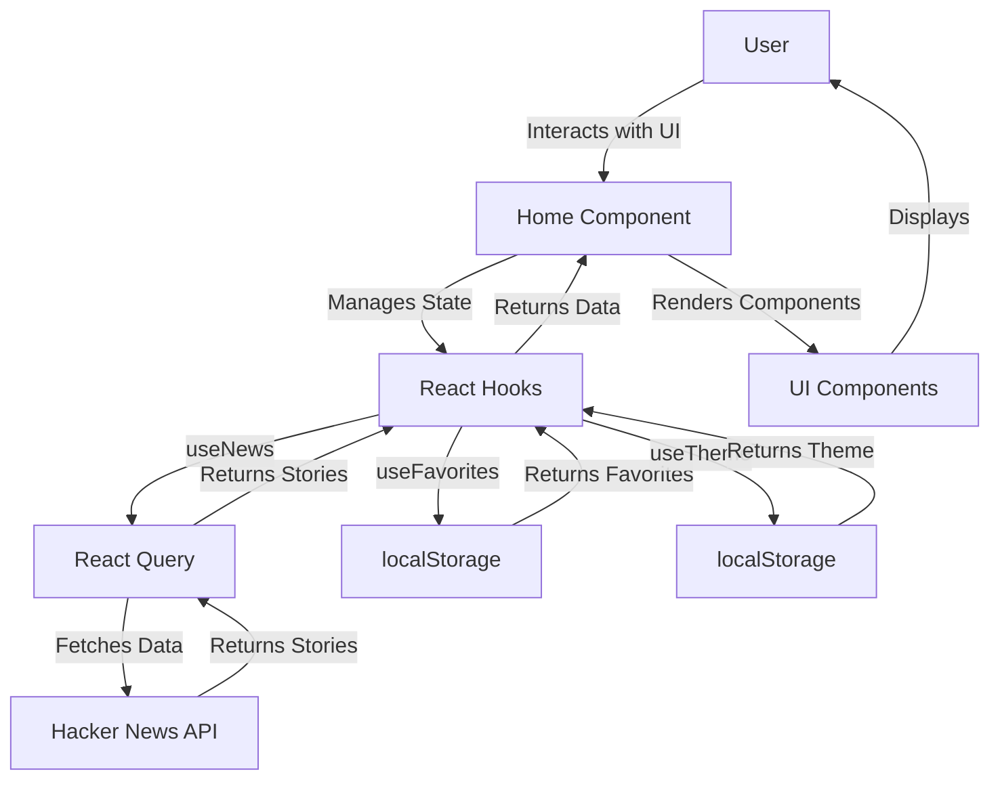
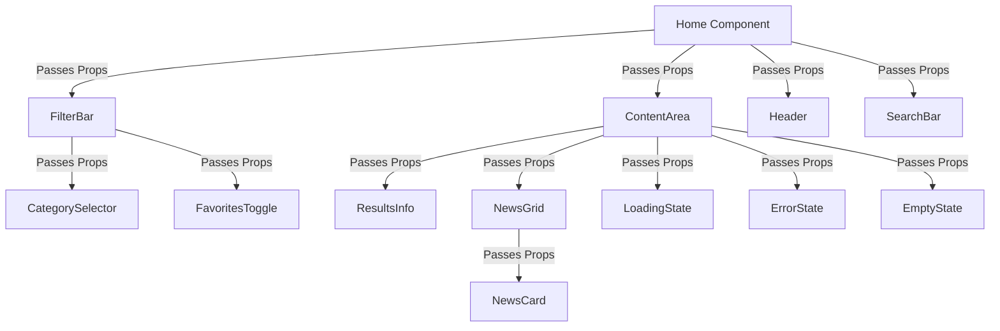
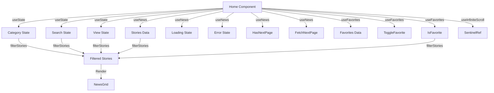
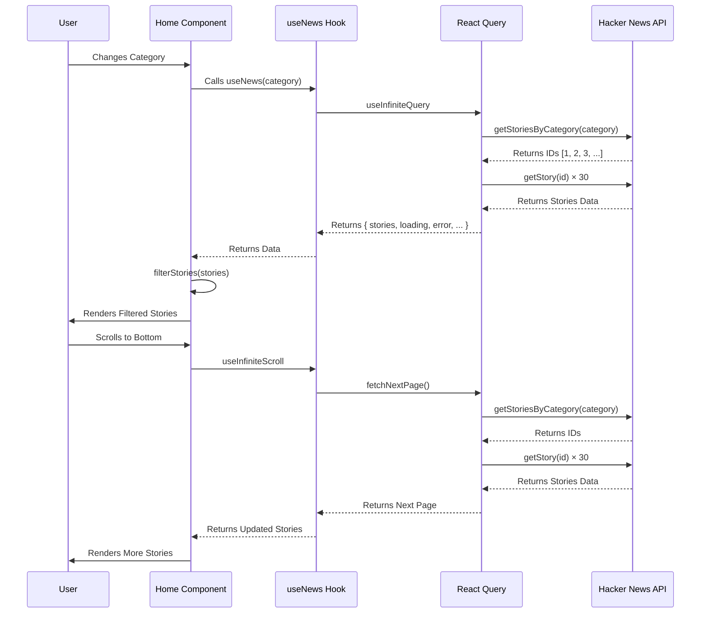
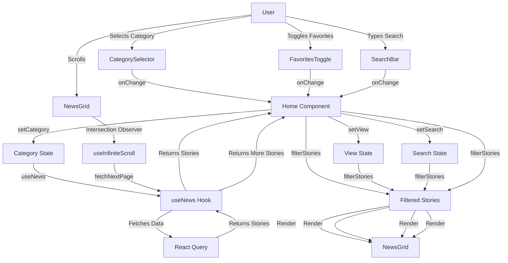
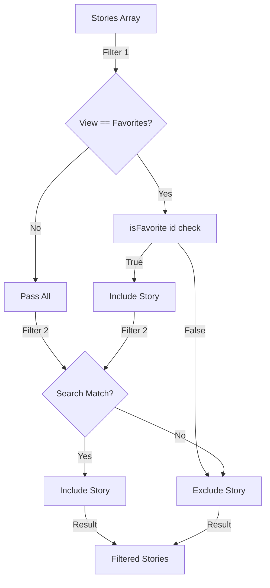
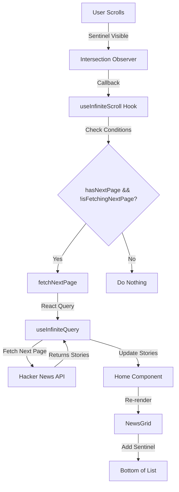
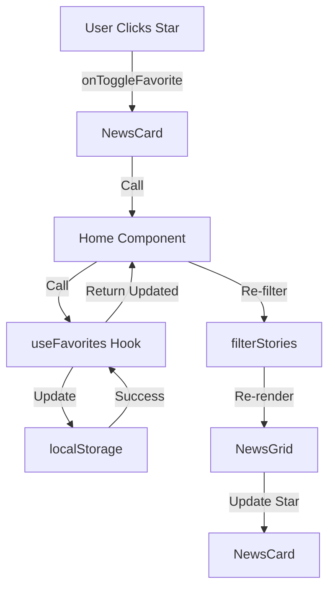
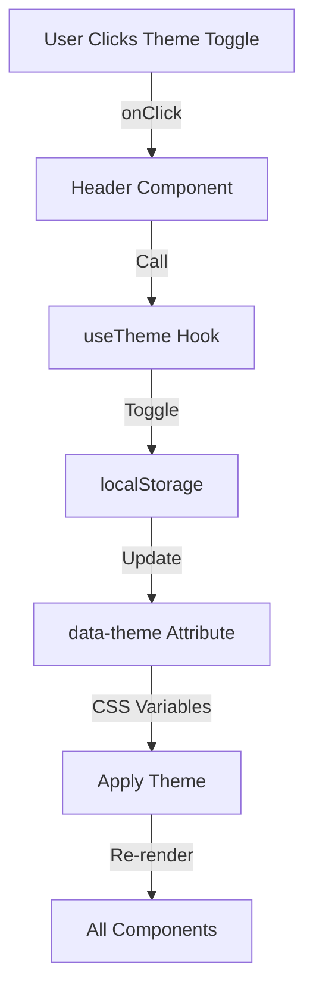

# Data Flow Documentation

This document describes the data flow in the AI & Tech Dashboard application using Mermaid diagrams.

## Table of Contents

- [High-Level Data Flow](#high-level-data-flow)
- [Component Data Flow](#component-data-flow)
- [State Management Flow](#state-management-flow)
- [API Data Flow](#api-data-flow)
- [User Interaction Flow](#user-interaction-flow)

---

## High-Level Data Flow



---

## Component Data Flow



---

## State Management Flow



---

## API Data Flow



---

## User Interaction Flow



---

## Filter Logic Flow



---

## Infinite Scroll Flow



---

## Favorites Flow



---

## Theme Flow



---

## Error Handling Flow

```mermaid
graph TD
    A[API Request] -->|Error| B[React Query]
    B -->|Return Error| C[useNews Hook]
    C -->|Return Error| D[Home Component]
    D -->|Pass Error| E[ContentArea]
    E -->|Check Error| F{Error Exists?}
    F -->|Yes| G[Render ErrorState]
    F -->|No| H[Check Loading}
    G -->|User Clicks Retry| I[onRetry]
    I -->|Call| C
    C -->|Refetch| B
    B -->|Retry Request| A
```

---

## Summary

The data flow in the AI & Tech Dashboard follows these patterns:

1. **Unidirectional Data Flow**: Data flows from hooks to components to UI
2. **State Management**: Local state managed with React hooks
3. **Data Fetching**: React Query handles API calls and caching
4. **User Interactions**: User actions trigger state updates
5. **Re-rendering**: State changes trigger component re-renders
6. **Filtering**: Stories filtered based on user preferences
7. **Infinite Scroll**: Intersection Observer triggers page fetching
8. **Persistence**: Favorites and theme persisted in localStorage

This architecture ensures predictable data flow, easy debugging, and good performance.
