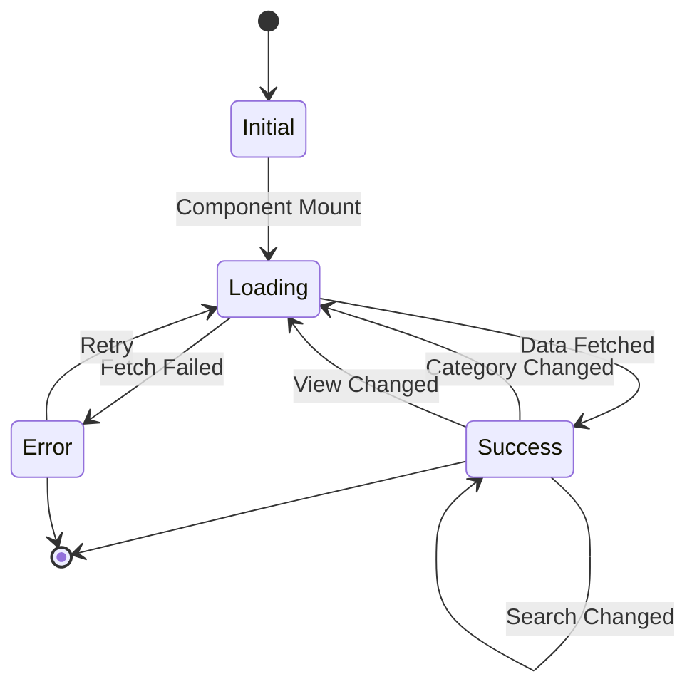
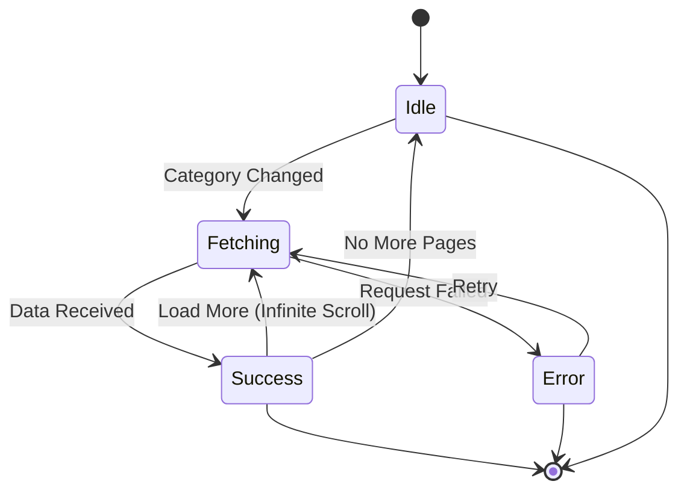
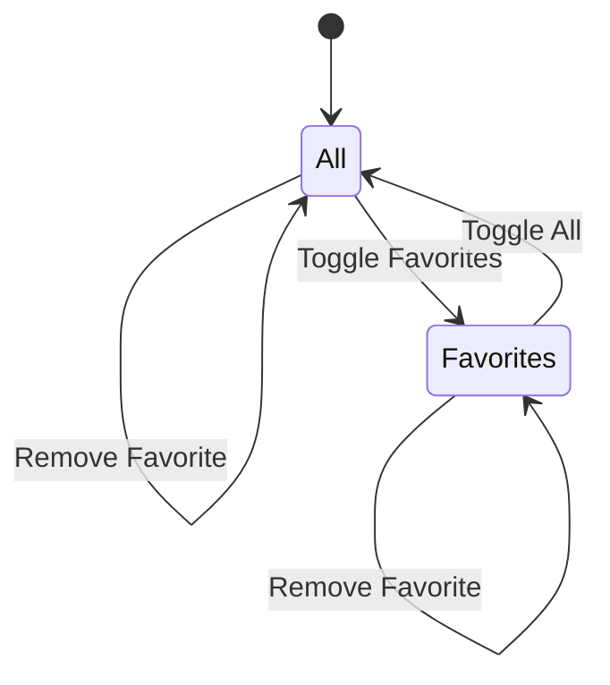
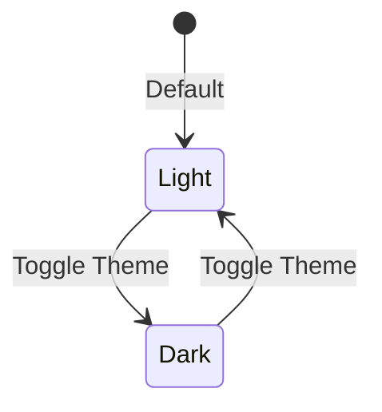
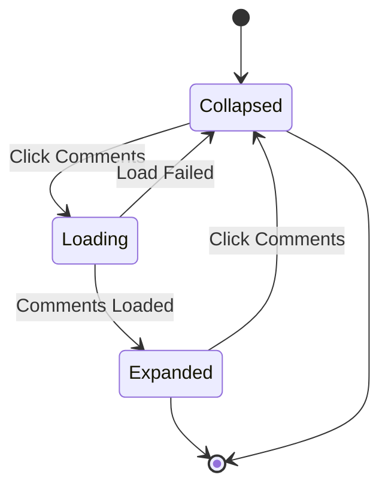
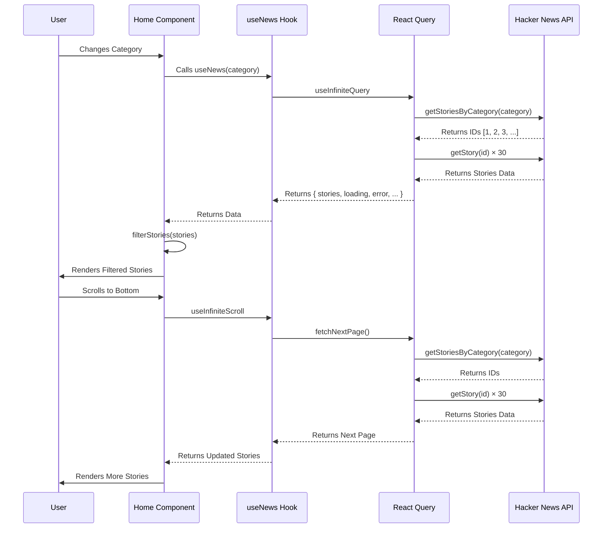

# State Flow Documentation

This document describes the state transitions in the AI & Tech Dashboard application using state diagrams.

## Table of Contents

- [Home Component State](#home-component-state)
- [News Fetching State](#news-fetching-state)
- [Favorites State](#favorites-state)
- [Theme State](#theme-state)
- [Comments State](#comments-state)
- [API Sequence Diagram](#api-sequence-diagram)

---

## Home Component State

---

## News Fetching State

---

## Favorites State

---

## Theme State

---

## Comments State

---

## API Sequence Diagram

---

## Summary

The state flow in the AI & Tech Dashboard follows these patterns:

1. **State Transitions**: Components transition between states based on user actions and data changes
2. **Loading States**: Async operations have explicit loading, success, and error states
3. **User Interactions**: User actions trigger state transitions
4. **Persistence**: Favorites and theme persisted in localStorage
5. **Infinite Scroll**: State transitions trigger page fetching
6. **Error Recovery**: Error states allow retry actions

This architecture ensures predictable state management, easy debugging, and good user experience.
