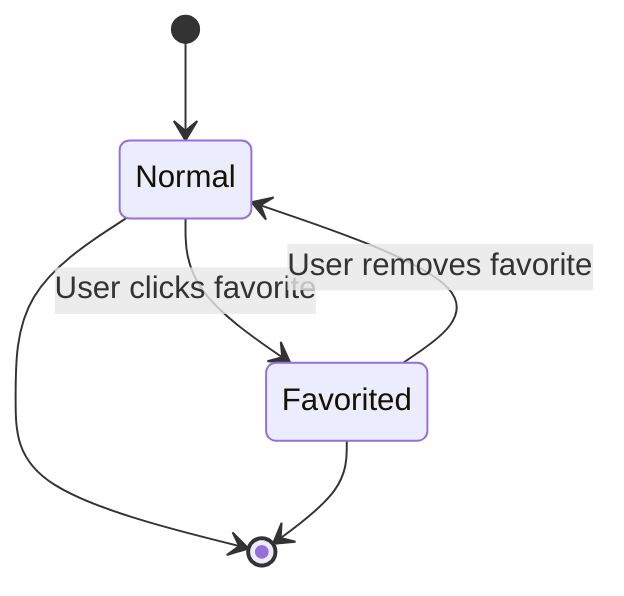
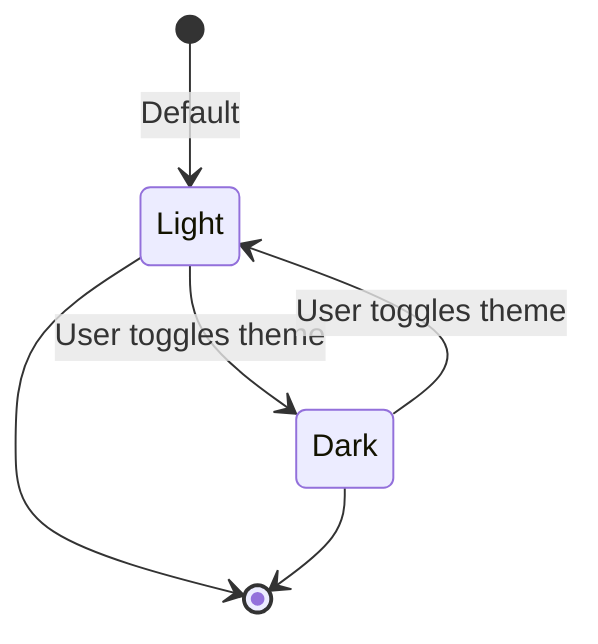
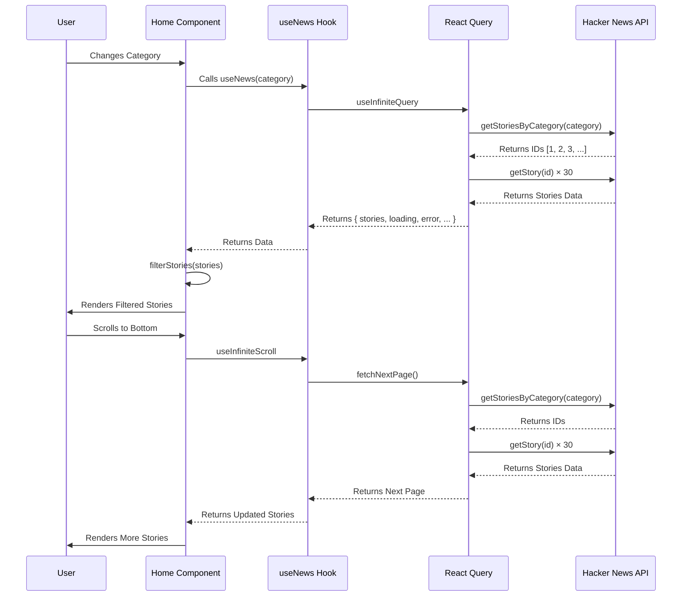

# Data Flow Documentation

This document describes the data flow and state transitions in the AI & Tech Dashboard application.

## Table of Contents

- [Story Favorite State](#story-favorite-state)
- [Theme State](#theme-state)
- [API Sequence Diagram](#api-sequence-diagram)

---

## Story Favorite State

A story can transition between normal and favorited states:

---

## Theme State

The application theme can transition between light and dark modes:

---

## API Sequence Diagram

---

## Summary

The data flow in the AI & Tech Dashboard follows these patterns:

1. **State Transitions**: Simple, project-specific state transitions (story favorite status, theme)
2. **Data Fetching**: React Query handles caching, retry, and state management
3. **User Interactions**: User actions trigger data flow through hooks
4. **Persistence**: Favorites and theme persisted in localStorage
5. **Infinite Scroll**: Efficient pagination with Intersection Observer
